# font-pairing-skill

An agent-ready skill for typeface selection, font pairing, type scale, variable fonts, and loading strategy.

## What this is

This repo contains a `SKILL.md` file that teaches an AI agent how to make deliberate, brand-appropriate typeface decisions — from choosing a display font and pairing it with a body face, to setting a type scale, matching typography to a palette and icon weight, and loading fonts efficiently without layout shift.

## What it covers

| Topic | Detail |
|---|---|
| **Typeface Categories** | Display serif, display sans, body faces, monospace |
| **Pairing Rules** | Contrast one dimension, match another — with safe combos and anti-patterns |
| **Archetype Recipes** | 8 complete font stacks by project type |
| **Type Scale** | Major Third and Perfect Fourth scales in CSS custom properties |
| **Variable Fonts** | `font-variation-settings` animation, free variable font list |
| **Web Font Loading** | `preconnect`, `preload`, `font-display: swap`, subsetting guidance |
| **Effects Compatibility** | Which typefaces work with gradient fill, glitch, stroke text, variable weight animation |
| **Color & Palette Match** | Font stack recommendations per named palette from color-combo-skill |
| **Google Fonts Import Reference** | 30+ copy-paste `@import` URLs by category |

## Skill Network

This skill is part of a four-skill design system:

| Skill | Covers |
|---|---|
| [color-combo-skill](https://github.com/bilioveloso/color-combo-skill) | Named palettes, contrast tiers, CSS usage |
| [design-effects-skill](https://github.com/bilioveloso/design-effects-skill) | Animations, morphisms, motion patterns |
| **font-pairing-skill** | Typeface selection, pairing rules, type scale |
| [icon-system-skill](https://github.com/bilioveloso/icon-system-skill) | Icon library selection, sizing, weight, animation |

## How to use

Point your agent at `SKILL.md` as a skill or context file. The agent will:

1. Identify the brand tier and mood.
2. Check Archetype Recipes — use that stack directly if it matches.
3. Customize with the Pairing Rules and Category Guide as needed.
4. Cross-reference `color-combo-skill` to confirm the palette matches the typographic mood.
5. Cross-reference `design-effects-skill` to confirm the typeface supports planned effects.
6. Cross-reference `icon-system-skill` to match icon stroke weight to the body typeface.

## Maintained by
[@bilioveloso](https://github.com/bilioveloso)
